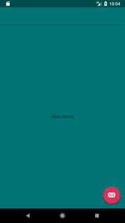
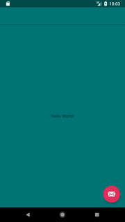

# AmActionSheet
You can use the three modes of this action sheet
1. Several buttons
2. custom view
3. Use the buttons as well as a custom view

# images


   **Several buttons**     / **custom view**   / **custom view & buttons**  

     
   
   
   
   # dependencies
   ```
allprojects {

	repositories {
	
	
		maven { url "https://jitpack.io" }
		
	}
	
}

dependencies {
       implementation 'com.github.arashAzizimanesh:amactionsheet:1.0.2'


}

```

 # use
 
 
 We first need to use the Action Sheet on the page that we want to use to create a view in the code:
 
 in xml
 
 ```
 <android.support.design.widget.CoordinatorLayout xmlns:android="http://schemas.android.com/apk/res/android"
    xmlns:app="http://schemas.android.com/apk/res-auto"
    xmlns:tools="http://schemas.android.com/tools"
    android:layout_width="match_parent"
    android:layout_height="match_parent"
    android:id="@+id/coordinator_layout"
    tools:context=".MainActivity">

    <android.support.design.widget.AppBarLayout
        android:layout_width="match_parent"
        android:layout_height="wrap_content"
        android:theme="@style/AppTheme.AppBarOverlay">

        <android.support.v7.widget.Toolbar
            android:id="@+id/toolbar"
            android:layout_width="match_parent"
            android:layout_height="?attr/actionBarSize"
            android:background="?attr/colorPrimary"
            app:popupTheme="@style/AppTheme.PopupOverlay" />

    </android.support.design.widget.AppBarLayout>

    <include layout="@layout/content_main" />

    <android.support.design.widget.FloatingActionButton
        android:id="@+id/fab"
        android:layout_width="wrap_content"
        android:layout_height="wrap_content"
        android:layout_gravity="bottom|end"
        android:layout_margin="@dimen/fab_margin"
        app:srcCompat="@android:drawable/ic_dialog_email" />

</android.support.design.widget.CoordinatorLayout>
 ```
 
 in code
 ```
 final CoordinatorLayout coordinatorLayout = findViewById(R.id.coordinator_layout);
 AmActionSheet amActionSheet = new AmActionSheet(MainActivity.this, coordinatorLayout);
 amActionSheet.setCancelTitle("cancel");
 ```
 ### Several buttons
 To make buttons, just make a list of the name of the button:
 ```
  final List<String> buttonsNameList = new ArrayList<>();
        buttonsNameList.add("a");
        buttonsNameList.add("b");
        buttonsNameList.add("c");
        buttonsNameList.add("d");
 
 ```
 
 and
 ```
 amActionSheet.setButtonsNameList(buttonsNameList);
 
 
 amActionSheet.setOnClickActionSheetListener(new OnClickActionSheetListener() {
    @Override
    public void onButtonClick(int positon) {
        
    }
});
            }
        });
    }

```

 ### Custom View
 
 First we create a leot for our custom view
 
 custom_layout.xml
 ```
 <?xml version="1.0" encoding="utf-8"?>
<RelativeLayout
    android:background="@color/colorAccent"
    xmlns:android="http://schemas.android.com/apk/res/android" android:layout_width="match_parent"
    android:layout_height="match_parent">
<RelativeLayout
    android:layout_width="match_parent"
    android:layout_height="match_parent">
    <ImageView
        android:layout_margin="20dp"
        android:src="@mipmap/ic_launcher"
        android:layout_width="match_parent"
        android:layout_height="match_parent" />
</RelativeLayout>
</RelativeLayout>
 ```
 
 in code 
 ```
 LayoutInflater inflater = (LayoutInflater) getSystemService(LAYOUT_INFLATER_SERVICE);
 View rootView = inflater.inflate(R.layout.custom_layout, null);
 ```
 
 and
 ```
 amActionSheet.setView(rootView);
 ```
 
 ### Custom View & buttons
 
 You can add your custom buttons and views simultaneously

  
   ```
    amActionSheet.setView(rootView);
     amActionSheet.setButtonsNameList(buttonsNameList);
   ```
 # init AmActionSheet
 
 In order to use AmActionSheet, we need to invoke the initAmActionSheet method
 
  ```
  amActionSheet.initAmActionSheet();
   ```
   
  ### for show :
  
  ```
  amActionSheet.showAmActionSheet();
  ```
  
  ### for dissmiss :
  
  ```
 amActionSheet.dissmissAmActionSheet();
  ```
  
  
 
